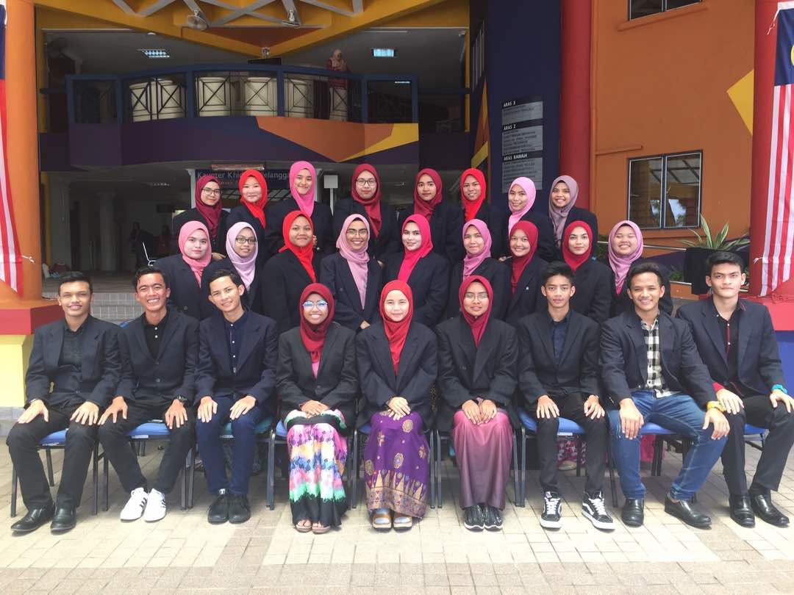
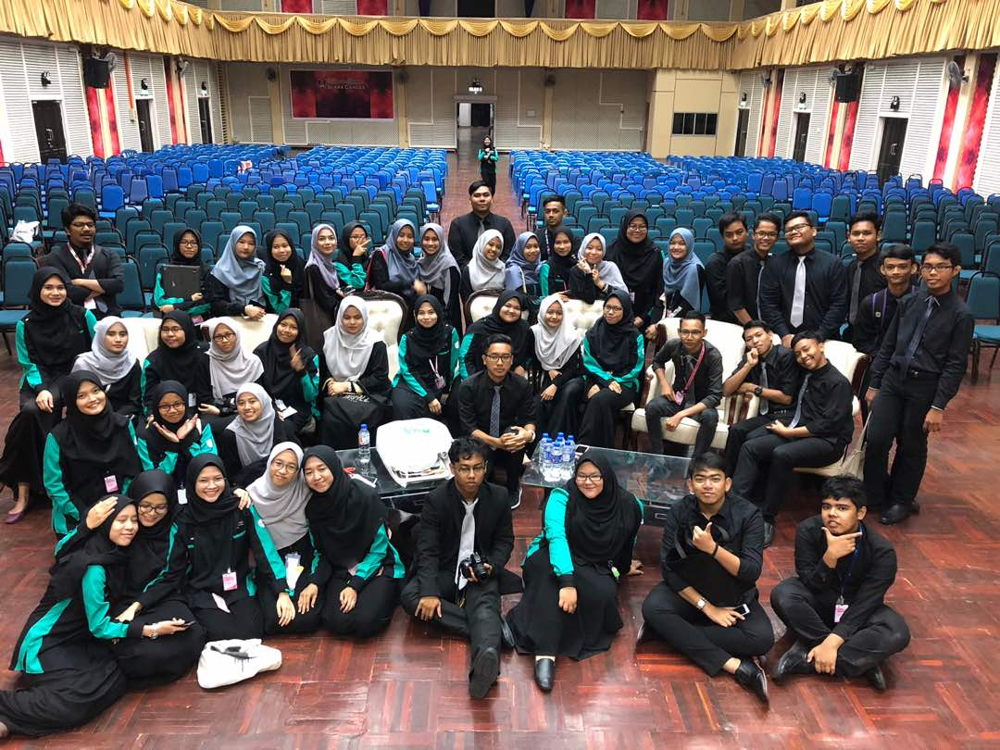
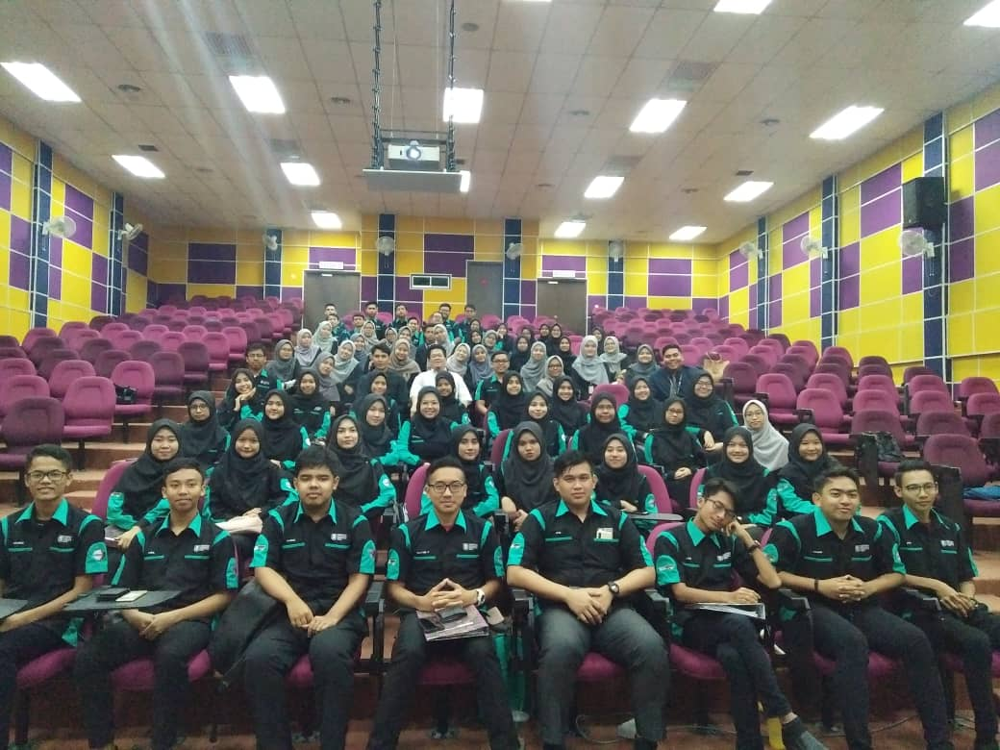
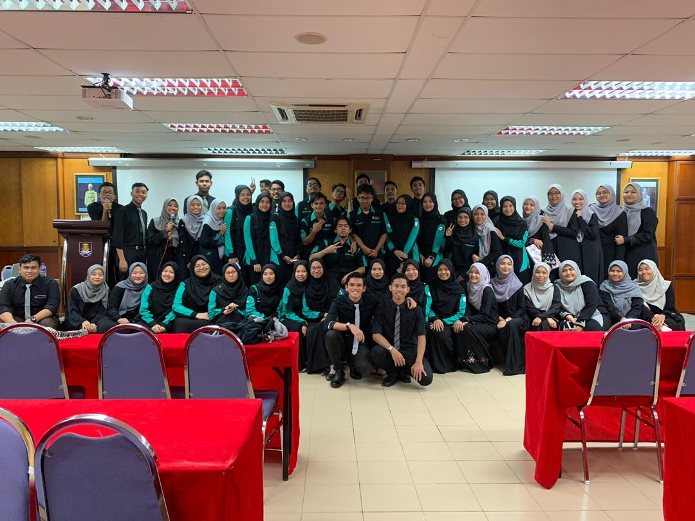
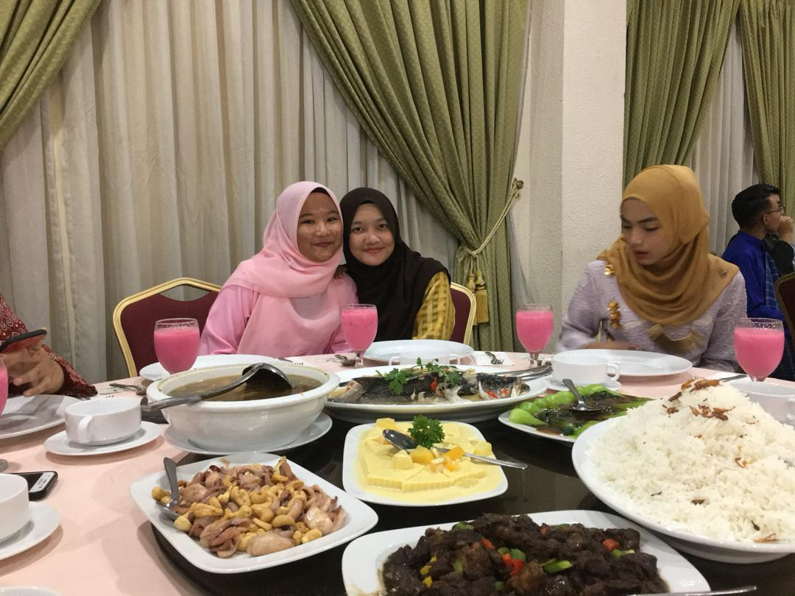
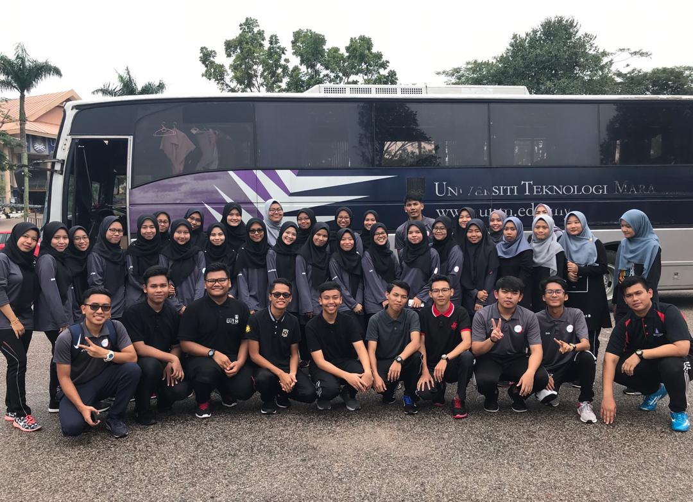
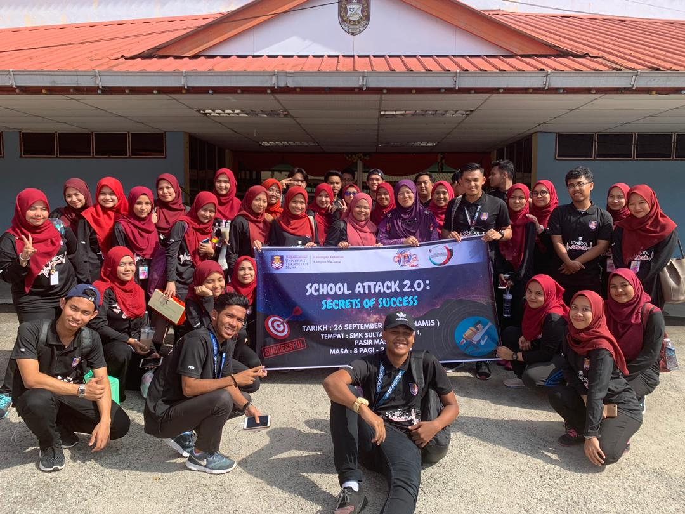
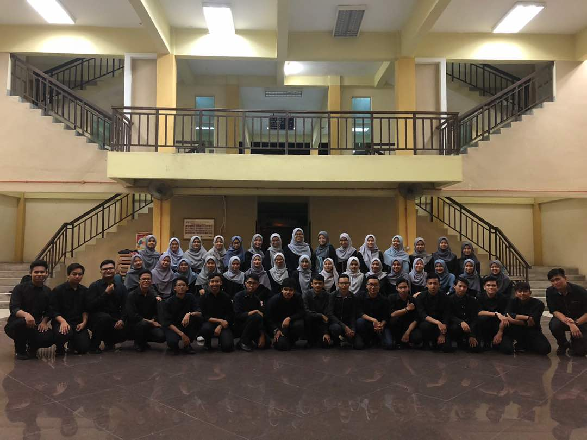
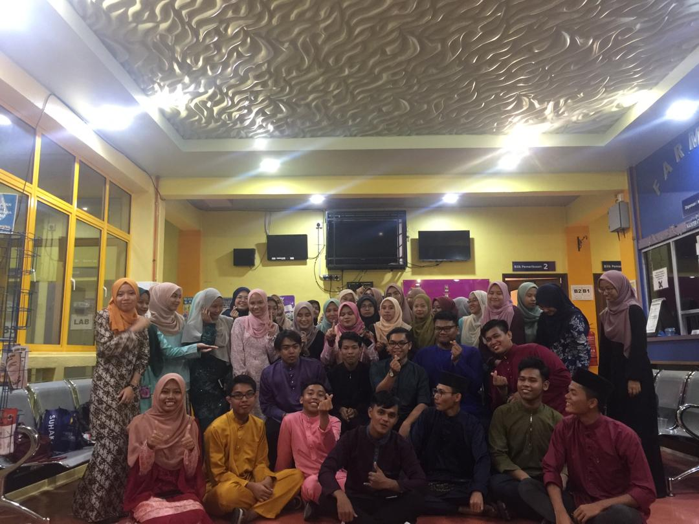
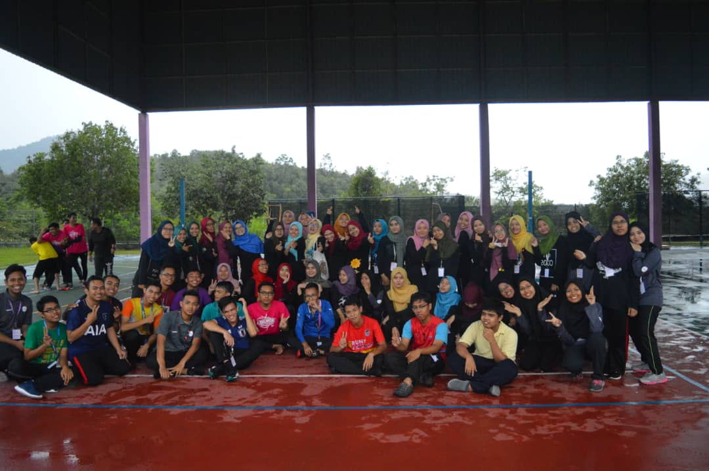

<!DOCTYPE html>
<html>
<head>
	<title>Portfolio Websites</title>
	<meta charset="UTF-8">
	<link rel="stylesheet" type="text/css" href="css/style.css">
	<link rel="stylesheet" type="text/css" href="https://cdnjs.cloudflare.com/ajax/libs/font-awesome/6.1.1/css/all.min.css">
	
</head>
<body>

	<!-- loader -->
	

		

	

	<!-- header -->
	

		

			<ul>
				<li><a href="https://www.facebook.com/norhaslina.abhazid"><i class="fa-brands fa-facebook"></i></a></li>
				<li><a href="https://www.instagram.com/invites/contact/?i=onkbrkahbjw&utm_content=2vw21wv"><i class="fa-brands fa-instagram"></i></a></li>
			</ul>
		

	

	<header>
		

			<h1><a href="index.html">PORTFOLIO WEBSITES</a></h1>
			<ul>
				<li class="active"><a href="index.html">HOME PAGE</a></li>
				<li><a href="aboutme.html">ABOUT ME</a></li>
				<li><a href="education.html">EDUCATION</a></li>
				<li><a href="experience.html">EXPERIENCE</a></li>
				<li><a href="gallery.html">GALLERY</a></li>
				<li><a href="contact.html">CONTACT</a></li>
			</ul>
		

	</header>

	<!-- banner -->
	<section class="banner">
		<h2>HI MY NAME IS...</h2>
		<h2>CHE NOR HASLINA</h2>
		<h2>WELCOME TO MY PERSONAL WEBSITES</h2>
	</section>

	<!-- about me -->
	<section class="aboutme">
		

			<h3>ABOUT ME</h3>
			
			<h4 style="color: pink">SELF INTRODUCTION
&#128151;
</h4>
			
<strong> 
				<ul><li>Name: Che Nor Haslina binti Cik Ab Hazid.</li>
					<li>Student ID: 2021126125</li>
					<li>Group: D2BA2424D</li>
					<li>Course Code: IMS456</li>
					<li>Course Name: Basic Web Design and Content Management</li>
					<li>Code Programme: BA242</li>
					<li>Faculty: Faculty of Business and Management</li>
					
<b><a href="default.asp" target="_blank">Download CV</a></b>

				</ul>
			</strong>

		

	</section>

	<!-- education -->
	<section class="education">
		

			<h3>EDUCATION BACKGROUND</h3>
			

				

					
<i class="fa-solid fa-school"></i>

					<h4>SMU (A) DARUL IMAN BERIS LALANG</h4>
					<ul><li>Year: 2015</li>
						<li>Level: PT3</li>
						<li>Course: Arabic</li>
						<li>Achievement: 7A 2B 2C</li>
					</ul>
				

				

					
<i class="fa-solid fa-school"></i>

					<h4>SMU (A) DARUL IMAN BERIS LALANG</h4>
					<ul><li>Year: 2017</li>
						<li>Level: SPM</li>
						<li>Course: Economy</li>
						<li>Achievement: 6A 4B</li>
					</ul>
				

				

					
<i class="fa-solid fa-university"></i>

					<h4>UiTM MACHANG</h4>>
					<ul><li>Year: 2018-2020</li>
						<li>Level: Diploma</li>
						<li>Course: Banking</li>
						<li>Achievement: 3.65</li>
					</ul>
				

				

					
<i class="fa-solid fa-university"></i>

					<h4>UiTM KOTA BHARU</h4>>
					<ul><li>Year: 2021-2023</li>
						<li>Level: Degree</li>
						<li>Course: Financing</li>
						<li>Achievement: 3.58</li>
					</ul>
				

			

		

	</section>

	<!-- experience -->
	<section class="experience">
		

			<h3>EXPERIENCE</h3>
				

<h2>Part Time Kindergarten Teacher</h2>
				<ul><li>Year: 2018-2020 (Every Semester Break)</li>
					<li>Job: Teaching Kindergarten Kids</li>
					<li>Job Place: Tadika Enclave Junior</li>
				</ul>
				<h2>Part-Time Business</h2>
				<ul><li>Year:2020-2022</li>
					<li>Job: Mini Agent for Aducktive brand</li>
					<li>Job Place: Work From Home</li>
				</ul>
			

				

		

	</section>

	<!-- gallery -->
	<section class="gallery">
		

			<h3>UNIVERSITY ACTIVITIES GALLERY</h3>
			
    
Diploma Classmates

    		
    
Diploma Groupmate

    		
    
University Programme

    		
    
University Club's Programme

    		
    
Annual Meeting

    		
    
Annual Dinner

    		
    
Annual Grand Dinner

    
    
Visit Kampung Orang Asli

    		
    
School Attack Program

    		
    
Prosis Team Club

    		
    
Hari Raya Celebration

    		
    
Family Day

		

	</section>

	<!-- contact -->
	<section class="contact">
		

			<h3>CONTACT</h3>
			

				

					<h4>Adress</h4>
					
No C-6 Kg Pohon Nenasi, 16070, Bachok, Kelantan

				

				

				

					<h4>E-mail</h4> > >
					
haslinahazid@gmail.com

				

				

				

					<h4>Phone Number</h4> > > 
					
011-27720268

				

				

				

					<h4>Available</h4>
					
Sunday-Thursday 8.00 a.m - 4.00 p.m

				

			

		

	</section>

	<!-- footer -->
	<footer>
		

			<small>Copyright &copy; 2022 - Che Nor Haslina. All Right Reserved.</small>
		

	</footer>

	
	

</body>
</html>

<!DOCTYPE html>
<html>
<head>
	<title>Portfolio Websites</title>
	<link rel="stylesheet" type="text/css" href="css/style.css">
	<link rel="stylesheet" type="text/css" href="https://cdnjs.cloudflare.com/ajax/libs/font-awesome/6.1.1/css/all.min.css">
	
</head>
<body>
	<!-- loader -->
	

		

	

	<!-- header -->
	

		

			<ul>
				<li><a href="https://www.facebook.com/norhaslina.abhazid"><i class="fa-brands fa-facebook"></i></a></li>
				<li><a href="https://www.instagram.com/invites/contact/?i=onkbrkahbjw&utm_content=2vw21wv"><i class="fa-brands fa-instagram"></i></a></li>
			</ul>
		

	

	<header>
		

			<h1><a href="index.html">PORTFOLIO WEBSITES</a></h1>
			<ul>
				<li><a href="index.html">HOME PAGE</a></li>
				<li><a href="aboutme.html">ABOUT ME</a></li>
				<li class="active"><a href="education.html">EDUCATION</a></li>
				<li><a href="experience.html">EXPERIENCE</a></li>
				<li><a href="gallery.html">GALLERY</a></li>
				<li><a href="contact.html">CONTACT</a></li>
			</ul>
		

	</header>

	<!-- label -->
	<section class="label">
		

			
Home / Education

		

	</section>

	<!-- education -->
	<section class="education">
		

			<h3>EDUCATION BACKGROUND</h3>
			

				

					
<i class="fa-solid fa-school"></i>

					<h4>SMU (A) DARUL IMAN BERIS LALANG</h4>
					<ul><li>Year: 2015</li>
						<li>Level: PT3</li>
						<li>Course: Arabic</li>
						<li>Achievement: 7A 2B 2C</li>
					</ul>
				

				

					
<i class="fa-solid fa-school"></i>

					<h4>SMU (A) DARUL IMAN BERIS LALANG</h4>
					<ul><li>Year: 2017</li>
						<li>Level: SPM</li>
						<li>Course: Economy</li>
						<li>Achievement: 6A 4B</li>
					</ul>
				

				

					
<i class="fa-solid fa-university"></i>

					<h4>UiTM MACHANG</h4>>
					<ul><li>Year: 2018-2020</li>
						<li>Level: Diploma</li>
						<li>Course: Banking</li>
						<li>Achievement: 3.65</li>
					</ul>
				

				

					
<i class="fa-solid fa-university"></i>

					<h4>UiTM KOTA BHARU</h4>>
					<ul><li>Year: 2021-2023</li>
						<li>Level: Degree</li>
						<li>Course: Financing</li>
						<li>Achievement: 3.58</li>
					</ul>
				

			

		

	</section>

	<!-- footer -->
	<footer>
		

			<small>Copyright &copy; 2022 - Che Nor Haslina. All Right Reserved.</small>
		

	</footer>

	
	

</body>
</html>

<!DOCTYPE html>
<html>
<head>
	<title>Portfolio Websites</title>
	<link rel="stylesheet" type="text/css" href="css/style.css">
	<link rel="stylesheet" type="text/css" href="https://cdnjs.cloudflare.com/ajax/libs/font-awesome/6.1.1/css/all.min.css">
	
</head>
<body>

	<!-- loader -->
	

		

	

	<!-- header -->
	

		

			<ul>
				<li><a href="https://www.facebook.com/norhaslina.abhazid"><i class="fa-brands fa-facebook"></i></a></li>
				<li><a href="https://www.instagram.com/invites/contact/?i=onkbrkahbjw&utm_content=2vw21wv"><i class="fa-brands fa-instagram"></i></a></li>
			</ul>
		

	

	<header>
		

			<h1><a href="index.html">PORTFOLIO WEBSITES</a></h1>
			<ul>
				<li><a href="index.html">HOME PAGE</a></li>
				<li><a href="aboutme.html">ABOUT ME</a></li>
				<li><a href="education.html">EDUCATION</a></li>
				<li class="active"><a href="experience.html">EXPERIENCE</a></li>
				<li><a href="gallery.html">GALLERY</a></li>
				<li><a href="contact.html">CONTACT</a></li>
			</ul>
		

	</header>

	<!-- label -->
	<section class="label">
		

			
Home / Experience

		

	</section>

	<!-- experience -->
	<section class="experience">
		

			<h3>EXPERIENCE</h3>
			
<h2>Part Time Kindergarten Teacher</h2>
				<ul><li>Year: 2018-2020 (Every Semester Break)</li>
					<li>Job: Teaching Kindergarten Kids</li>
					<li>Job Place: Tadika Enclave Junior</li>
				</ul>
				<h2>Part-Time Business</h2>
				<ul><li>Year:2020-2022</li>
					<li>Job: Mini Agent for Aducktive brand</li>
					<li>Job Place: Work From Home</li>
				</ul>
			

		

	</section>

	<!-- footer -->
	<footer>
		

			<small>Copyright &copy; 2022 - Che Nor Haslina. All Right Reserved.</small>
		

	</footer>

	
	

</body>
</html>

<!DOCTYPE html>
<html>
<head>
	<title>Portfolio Websites</title>
	<link rel="stylesheet" type="text/css" href="css/style.css">
	<link rel="stylesheet" type="text/css" href="https://cdnjs.cloudflare.com/ajax/libs/font-awesome/6.1.1/css/all.min.css">
	
</head>
<body>

	<!-- loader -->
	

		

	

	<!-- header -->
	

		

			<ul>
				<li><a href="https://www.facebook.com/norhaslina.abhazid"><i class="fa-brands fa-facebook"></i></a></li>
				<li><a href="https://www.instagram.com/invites/contact/?i=onkbrkahbjw&utm_content=2vw21wv"><i class="fa-brands fa-instagram"></i></a></li>
			</ul>
		

	

	<header>
		

			<h1><a href="index.html">PORTFOLIO WEBSITES</a></h1>
			<ul>
				<li><a href="index.html">HOME PAGE</a></li>
				<li><a href="aboutme.html">ABOUT ME</a></li>
				<li><a href="education.html">EDUCATION</a></li>
				<li><a href="experience.html">EXPERIENCE</a></li>
				<li class="active"><a href="gallery.html">GALLERY</a></li>
				<li><a href="contact.html">CONTACT</a></li>
			</ul>
		

	</header>

	<!-- label -->
	<section class="label">
		

			
Home / Gallery

		

	</section>

	<!-- gallery -->
	<section class="gallery">
		

			<h3>UNIVERSITY ACTIVITIES GALLERY</h3>
			
    
Diploma Classmates

    		
    
Diploma Groupmate

    		
    
University Programme

    		
    
University Club's Programme

    		
    
Annual Meeting

    		
    
Annual Dinner

    		
    
Annual Grand Dinner

    
    
Visit Kampung Orang Asli

    		
    
School Attack Program

    		
    
Prosis Team Club

    		
    
Hari Raya Celebration

    		
    
Family Day

		

	</section>

	<!-- footer -->
	<footer>
		

			<small>Copyright &copy; 2022 - Che Nor Haslina. All Right Reserved.</small>
		

	</footer>

	
	

</body>
</html>

<!DOCTYPE html>
<html>
<head>
	<title>Portfolio Websites</title>
	<link rel="stylesheet" type="text/css" href="css/style.css">
	<link rel="stylesheet" type="text/css" href="https://cdnjs.cloudflare.com/ajax/libs/font-awesome/6.1.1/css/all.min.css">
	
</head>
<body>
	<!-- loader -->
	

		

	

	<!-- header -->
	

		

			<ul>
				<li><a href="https://www.facebook.com/norhaslina.abhazid"><i class="fa-brands fa-facebook"></i></a></li>
				<li><a href="https://www.instagram.com/invites/contact/?i=onkbrkahbjw&utm_content=2vw21wv"><i class="fa-brands fa-instagram"></i></a></li>
			</ul>
		

	

	<header>
		

			<h1><a href="index.html">PORTFOLIO WEBSITES</a></h1>
			<ul>
				<li><a href="index.html">HOME PAGE</a></li>
				<li><a href="aboutme.html">ABOUT ME</a></li>
				<li><a href="education.html">EDUCATION</a></li>
				<li><a href="experience.html">EXPERIENCE</a></li>
				<li><a href="gallery.html">GALLERY</a></li>
				<li class="active"><a href="contact.html">CONTACT</a></li>
			</ul>
		

	</header>

	<!-- label -->
	<section class="label">
		

			
Home / Contact

		

	</section>

	<!-- contact -->
	<section class="contact">
		

			<h3>CONTACT</h3>
			

				

					<h4>Adress</h4>
					
No C-6 Kg Pohon Nenasi, 16070, Bachok, Kelantan

				

				

				

					<h4>E-mail</h4> > >
					
haslinahazid@gmail.com

				

				

				

					<h4>Phone Number</h4> > > 
					
011-27720268

				

				

				

					<h4>Available</h4>
					
Sunday-Thursday 8.00 a.m - 4.00 p.m

				

			

		

	</section>

	<!-- footer -->
	<footer>
		

			<small>Copyright &copy; 2022 - Che Nor Haslina. All Right Reserved.</small>
		

	</footer>

	
	

</body>
</html>

* {
	padding:0;
	margin:0;
	font-family: sans-serif;
}
a {
	color: inherit;
	text-decoration: none;
}
.medsos {
	padding:5px 0;
	background-color: #FA9696;
}
.medsos ul li {
	display: inline-block;
	color: #fff;
	margin-right: 10px;
}
.container {
	width:80%;
	margin:0 auto;
}
.container:after {
	content:'';
	display: block;
	clear: both;
}
header h1 {
	float:left;
	padding:15px 0;
	color: #E9967A;
}
header ul {
	float:right;
}
header ul li {
	display: inline-block;
}
header ul li a {
	padding:25px 20px;
	display: inline-block;
}
header ul li a:hover {
	background-color: #E9967A;
	color: #fff;
}
.active {
	background-color: #E9967A;
	color: #fff;
}
.banner {
	height: 60vh;
	background-image: url('../img/banner.jpeg');
	background-size: cover;
	position: relative;
	display: flex;
	justify-content: center;
	align-items: center;
}
.banner:after {
	content:'';
	display: block;
	position: absolute;
	top: 0;
	left: 0;
	right: 0;
	bottom: 0;
	background-color: rgba(204, 204, 255, .6);
}
.banner h2 {
	color: #fff;
	z-index: 1;
	padding:20px 25px;
	width: 150px;
  	height: 100px;
  	background-color: hsla(0, 100%, 30%, 0.3);
  	position: relative;
  	animation-name: example;
  	animation-duration: 20s;
}
@keyframes example {
	0%   {background-color:hsla(0, 100%, 30%, 0.3); left:0px; top:0px;}
  	25%  {background-color:hsla(0, 100%, 50%, 0.3); left:200px; top:0px;}
  	50%  {background-color:hsla(0, 100%, 70%, 0.3); left:200px; top:200px;}
  	75%  {background-color:hsla(0, 100%, 90%, 0.3); left:0px; top:200px;}
  	100% {background-color:hsla(0, 100%, 30%, 0.3); left:0px; top:0px;}
}
section {
	padding:50px 0;
}
section h3 {
	text-align: center;
	padding:20px 0;
	color: #E9967A;
	margin-bottom: 25px;
}
.aboutme,
.education {
	background-color: lightgray;
	padding-bottom: 100px;
}
.aboutme p {
	background-color: lightgray;
	color: #666;
	word-spacing:20px;
	line-height: 25px;
	margin-bottom: 20px;
	text-align: center;
	align-items: center;	
}
.aboutme img {
	display: block;
	margin-left: auto;
	margin-right: auto;
	width: 50%;
	border-radius: 50%

}
.aboutme h4 {
	margin-top: 40px;
	display: block;
	margin-left: auto;
	margin-right: auto;
	width: 50%;
	font-family: sans-serif;
	background-color: black;
	text-align: center;
	font-size: 30px;
}
.aboutme ul li {
	display: block;
	margin-left: auto;
	margin-right: auto;
	width: 10%;
	color: gray;
	background-color: rgba(255, 99, 71, 0.5);
	border-radius: 50px / 50px;
 	padding: 25px; 
  	width: 700px;
  	height: 50px; 
	text-shadow: -1px 0 black, 0 1px black, 1px 0 black, 0 -1px black;
	text-align:left;
	font-size: 30px;
	font-style: Georgia, serif;
	margin-top: 10px;
	margin-bottom: 10px;
}
.aboutme a {
  color: red; 
  color: green;
}
.aboutme a:hover {
  color: hotpink;
}

.aboutme a:active {
  color: blue;
}
.aboutme p b a {
	display: block;
	margin-left: auto;
	margin-right: auto;
	width: 10%;
	color: gray;
	background-color: black;
	border-radius: 50px / 50px;
 	padding: 25px; 
  	width: 200px;
  	height: 20px; 
	text-shadow: -1px 0 black, 0 1px black, 1px 0 black, 0 -1px black;
	text-align:left;
	font-size: 25px;
	font-style: Georgia, serif;
	margin-top: 10px;
	margin-bottom: 10px;
	word-wrap: normal;
}
.education {
	background-color: lightgray;
}
.box {
	border: 1px solid;
	color: #E9967A;
}
.box: after {
	content: '';
	display: block;
	clear: both;
}
.box .col-4 {
	width: 25%;
	padding:20px;
	box-sizing: border-box;
	border: 1px solid;
	text-align: center;
	float: left;
}
.icon {
	width: 70px;
	height: 70px;
	border: 1px solid;
	border-radius: 50%;
	text-align: center;
	line-height: 70px;
	font-size: 40px;
	margin: 0 auto;
}
.box .col-4 h4 {
	margin: 20px 0;
}
.experience {
	background-color: lightgray;
}
.experience h2 {
	word-wrap: break-word;
	font-size: 40px;
	font-weight: 40px;
	border-radius: 15px;
  	background: rgba(255,0,0,0.3);
  	padding: 20px; 
  	width: 800px;
  	height: 50px;
  	margin-bottom: 20px;
  	text-align: center;
  	display: block;
  	margin-left: auto;
  	margin-right: auto;
  	object-fit: fill; 
}
.experience ul li {
	font-family: Georgia, serif;
	font-size: 30px;
	font-weight: 20px;
}
.experience div ul li {
  border: 1px solid blue;
  text-align: center;
  margin-bottom: 20px;
  border-radius: 15px 50px;
  background: hsla(0, 100%, 70%, 0.3);
  padding: 20px; 
  width: 200px;
  height: 50px;
  display: block;
  margin-left: auto;
  margin-right: auto;
  width: 50%;
}
.gallery {
	background-color: lightgray;
	display: block;
	margin-left: auto;
	margin-right: auto;
	margin-bottom: auto;
	text-orientation: inherit;
}
.gallery img {
	background-color: lightgray;
	color: #666;
	word-spacing:10px;
	line-height: 25px;
	margin-bottom: 20px;
	text-align: center;
	align-items: center;
	display: block;
	margin-left: auto;
	margin-right: auto;
	width: 100%;
}
.gallery div {
	background-color: lightgray;
	color: #666;
	word-spacing:10px;
	line-height: 25px;
	margin-bottom: 20px;
	text-align: center;
	align-items: center;
	display: block;
	margin-left: auto;
	margin-right: auto;
	width: 50%;
}
.contact {
	background-color: lightgray;
}
footer {
	padding: 30px 0;
	background-color: #333;
	color: #fff;
	text-align: center;
}
.bg-loader {
	background-color: #eee;
	position: fixed;
	top: 0;
	left: 0;
	right: 0;
	bottom: 0;
	z-index: 9999;
	display: flex;
	justify-content: center;
	align-items: center;
}
.bg-loader .loader {
	width: 100px;
	height: 100px;
	border: 3px solid #fff;
	border-radius: 50%
	border-top-color:#E9967A;
	border-right-color: #E9967A;
	border-bottom-color:  #E9967A;
	animation: putar .5s linear infinite;

}
.label {
	background-color: #E9967A;
	color: #fff;
}
@keyframes putar {
	100% {
		transform: rotate(360deg);
	}
}
@media screen and (max-width: 768px){
	.container {
		width: 90%;
	}
	header h1 {
		text-align: center;
		float: none;
	}
	header ul {
		text-align: center;
		float: none;
	}
	.box .col-4 {
		width: 100%;
		float: none;
		margin-bottom: 20px;
	}
}
